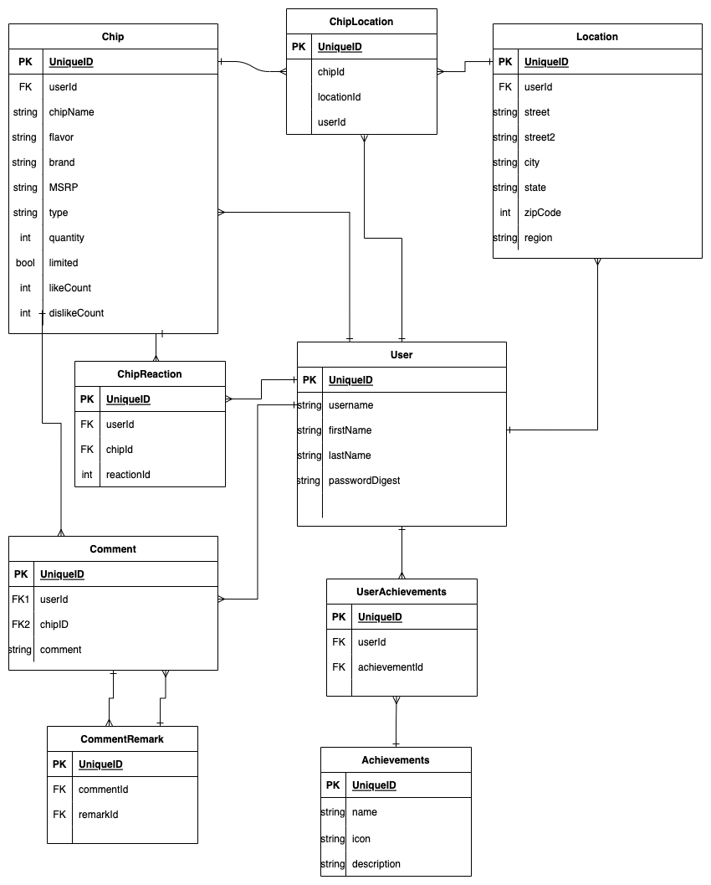

# Chippy

## Software Engineers: Kalen Luciano, Jeremy Harrell, Stephan Ramalho, and Shondriane Mesa-Wise

## UX Designers: Elnaz Talaei

### Kalen Luciano [GitHub](https://github.com/kalenluciano) | [LinkedIn](https://www.linkedin.com/in/kalenluciano/)

### Jeremy Harrell [GitHub](https://github.com/wolfy1313) | [LinkedIn](https://www.linkedin.com/in/jeremy-harrell-softwareengineer/)

### Stephan Ramalho [GitHub](https://github.com/sramalho94) | [LinkedIn](https://www.linkedin.com/in/stephan-ramalho/)

### Shondriane Mesa-Wise [GitHub](https://github.com/shondriane) | [LinkedIn](https://www.linkedin.com/in/shondriane-mesa-wise/)

### Elnaz Talaei [LinkedIn](https://www.linkedin.com/in/elnaz-talaei/)

---

#### [Chippy Frontend](https://github.com/sramalho94/chippy_frontend)

#### Deployed Site Coming Soon

---

### **_Description_**

---

### **_Getting Started_**

-   `Fork` and `clone`
-   `cd` into the directory
-   Run `npm i`
-   Run `sequelize db:create`
-   Run `sequelize db:migrate`
-   Run `sequelize db:seed:all`
-   Run `npm run dev`

#### **_Getting Started With Docker_**

-   `Fork` and `clone`
-   `cd` into the directory
-   TBD

A Trello board was used to keep track of development progress and can be viewed [here](https://trello.com/b/aYr3FtOC/ksj-project).

---

### **_Technologies_**

-   PostgreSQL
-   Express.js
-   Node.js
-   JavaScript

**_Entity Relationship Diagram:_**

## 

---

### **_Future Updates_**

-   [ ] Expand database to generalize chips to all types of snacks
